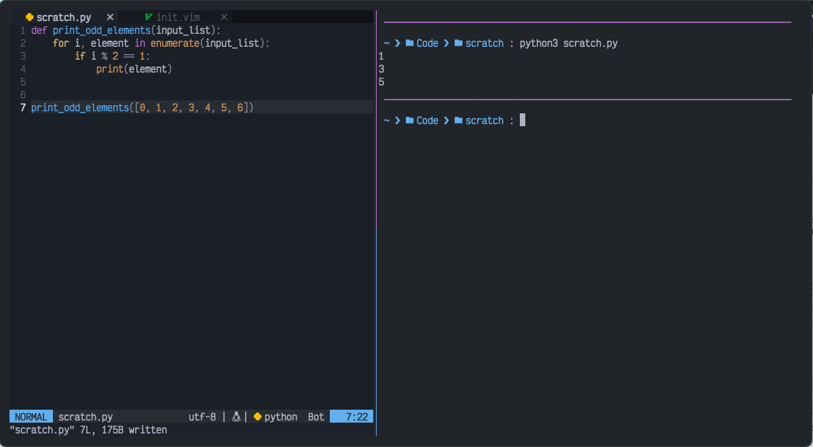

# OneDarker for iTerm

This is an iTerm port of the [OneDarker colorscheme from LunarVim](https://github.com/LunarVim/onedarker.nvim). The [existing OneDark theme for iTerm2](https://github.com/one-dark/iterm-one-dark-theme) provided the basis for this port.

# Usage
Download onedarker.itermcolors to your machine. In iTerm settings go to `Profiles->Colors` then select `Import...` from the color list.

Feel free to open an issue/PR for anything that needs to be fixed/improved.
